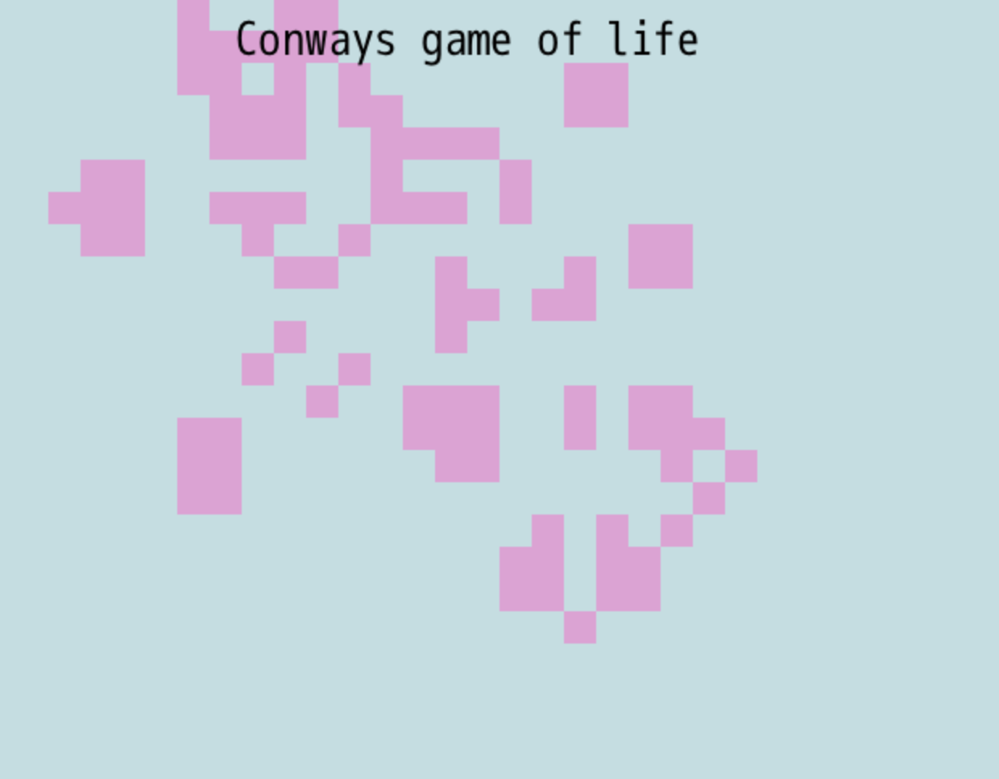

## My take on Conways game of life with ruby

## Description

Play at [itch.io](https://squishibutz.itch.io/sguis-conways)

game.rb can be run standalone.
sguis-conways contains the dragonruby version of this implementation

## Changelog

v0.1 - Released with pause/unpause and click to add/remove cells

## Todo

* Reset
* Zoom
* Better Graphics